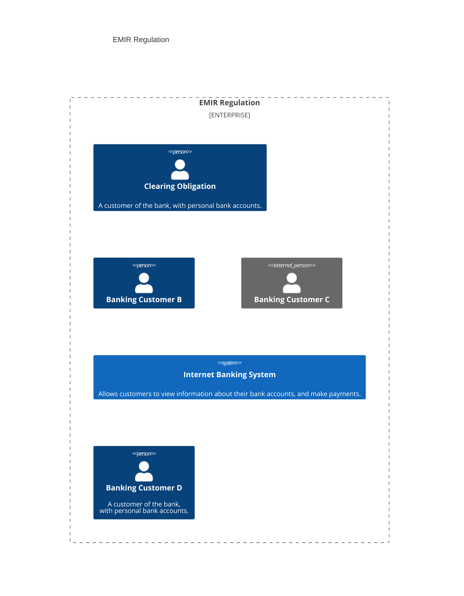

# TestSqlScripts

simple flow chart using mermaid

```mermaid
C4Context
title EMIR Regulation
Enterprise_Boundary(b1, "EMIR Regulation") {

Person(customerA, "Clearing Obligation", "A customer of the bank, with personal bank accounts.")
Person(customerB, "Banking Customer B")
Person_Ext(customerC, "Banking Customer C")
System(SystemAA, "Internet Banking System", "Allows customers to view information about their bank accounts, and make payments.")

Person(customerD, "Banking Customer D", "A customer of the bank, <br/> with personal bank accounts.")

}
```
